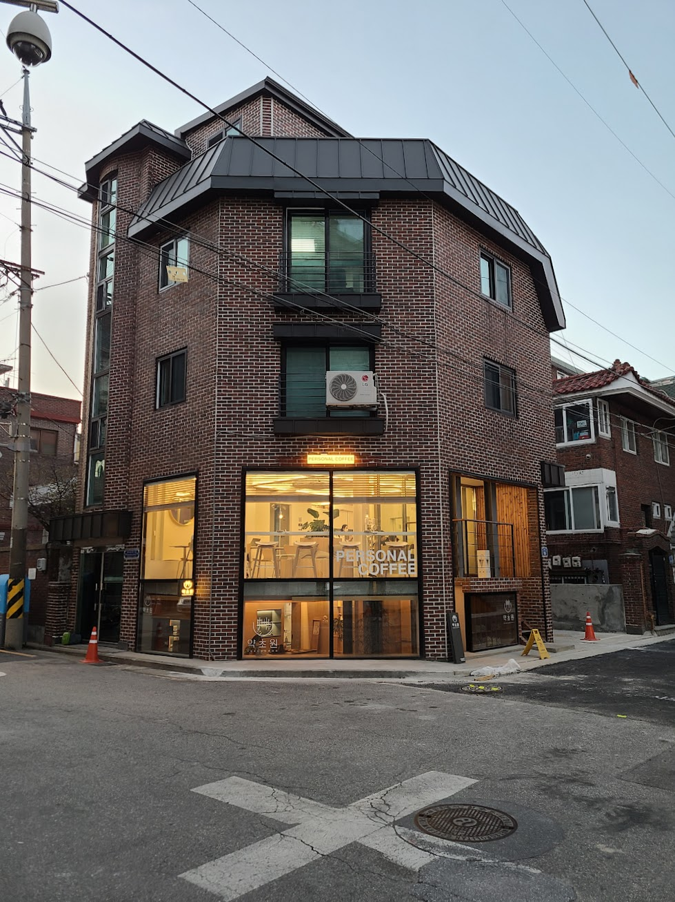
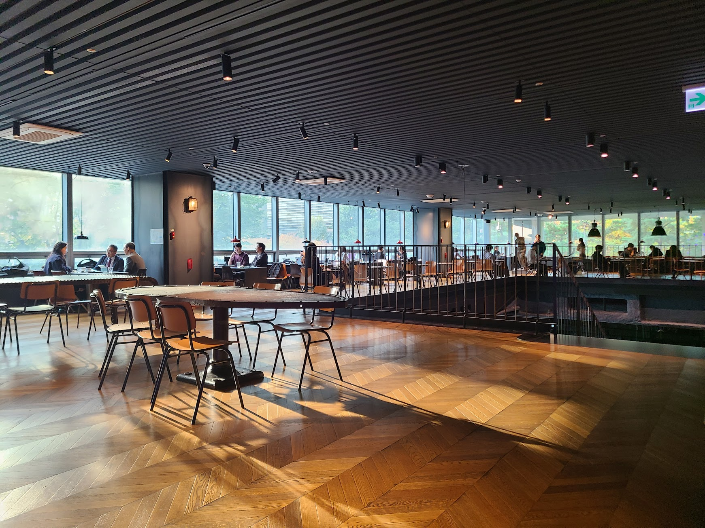

## 문제 1

Q: 다음 이미지에 대한 설명 중 옳지 않은 것은 무엇인가요?
- (1) 많은 사람들이 노트북을 사용하고 있는 모습이 보입니다.
- (2) 천장에 조명이 많이 설치되어 있습니다.
- (3) "DIVE 2024 IN BUSAN"이라는 글자가 보입니다.
- (4) 사람들은 주로 야외에서 활동하고 있습니다.

Listening: Which of the following descriptions of the image is incorrect?
- (1) A lot of people are using laptops.
- (2) There are many lights installed on the ceiling.
- (3) The text "DIVE 2024 IN BUSAN" is visible.
- (4) People are mostly engaged in outdoor activities.

정답: (4) 사람들은 건물 내부에서 활동하고 있습니다.

---------------------

## 문제 2

Q: 다음 이미지에 대한 설명 중 옳지 않은 것은 무엇인가요?
- (1) 노란색 조형물이 있습니다.
- (2) 건물 위에는 "Local Stitch"라는 글자가 보입니다.
- (3) 조형물은 초록색입니다.
- (4) 건물 벽은 벽돌로 만들어져 있습니다.

Listening: Which of the following descriptions of the image is incorrect?
- (1) There is a yellow sculpture.
- (2) The words "Local Stitch" can be seen on the building.
- (3) The sculpture is green.
- (4) The building walls are made of brick.

정답: (3) 조형물은 초록색이 아닌 노란색입니다.

---------------------

## 문제 3

Q: 다음 이미지에 대한 설명 중 옳지 않은 것은 무엇인가요?
- (1) 카페 내부 모습이 담겨 있습니다.
- (2) 카운터 뒤의 벽은 노란색입니다.
- (3) 벽에 시계가 걸려 있습니다.
- (4) 의자와 테이블이 놓여 있습니다.

Listening: Which of the following descriptions of the image is incorrect?
- (1) It shows the interior of a cafe.
- (2) The wall behind the counter is yellow.
- (3) There is a clock on the wall.
- (4) There are chairs and tables.

정답: (3) 벽에 시계가 걸려 있지 않습니다.

---------------------

## 문제 4

Q: 다음 이미지에 대한 설명 중 옳지 않은 것은 무엇인가요?
- (1) 벽돌 건물이 보입니다.
- (2) 2층에는 PERSONAL COFFEE라는 간판이 보입니다.
- (3) 건물 앞에 원뿔 모양의 주황색 물체가 있습니다.
- (4) 건물은 네 거리의 모퉁이에 위치해 있습니다.

Listening: Which of the following descriptions of the image is incorrect?
- (1) A brick building is visible.
- (2) There is a sign that says PERSONAL COFFEE on the second floor.
- (3) There is a cone-shaped orange object in front of the building.
- (4) The building is located at the corner of four streets.

정답: (2) 2층이 아닌 1층에 PERSONAL COFFEE라는 간판이 보입니다.

---------------------

## 문제 5

Q: 다음 이미지에 대한 설명 중 옳지 않은 것은 무엇인가요?
- (1) 유리 진열장 안에 다양한 종류의 빵이 진열되어 있습니다.
- (2) 점원이 흰색 모자를 착용하고 있습니다.
- (3) 진열장 위에는 노란색 가격표가 보입니다.
- (4) 이미지에서 두 명 이상의 점원이 보입니다.

Listening: Which of the following descriptions of the image is incorrect?
- (1) There are various types of bread displayed inside the glass case.
- (2) A clerk is wearing a white hat.
- (3) Yellow price tags can be seen on the display.
- (4) More than one clerk is visible in the image.

정답: (3) 진열장 위에는 노란색 가격표가 아닌 흰색 가격표가 보입니다.

---------------------

## 문제 6

Q: 다음 이미지에 대한 설명 중 옳지 않은 것은 무엇인가요?

- (1) 사람들이 베이커리 카페 앞에서 작업을 하고 있습니다.
- (2) '뉴트리코어'라는 상점이 보입니다.
- (3) 카페의 간판은 초록색입니다.
- (4) 작업자들은 모두 노란색 안전모를 쓰고 있습니다.

Listening: Which of the following descriptions of the image is incorrect?

- (1) People are working in front of a bakery cafe.
- (2) There is a store called 'Nutricore.'
- (3) The cafe's sign is green.
- (4) All workers are wearing yellow helmets.

정답: (4) 작업자들은 노란색 안전모를 쓰고 있지 않습니다.

---------------------

## 문제 7

Q: 다음 이미지에 대한 설명 중 옳지 않은 것은 무엇인가요?

- (1) 몇몇 사람들이 테이블에 앉아 대화하고 있습니다.
- (2) 바닥은 나무 마루로 되어 있습니다.
- (3) 창문을 통해 실외가 보이지 않습니다.
- (4) 조명들이 천장에 설치되어 있습니다.

Listening: Which of the following descriptions of the image is incorrect?

- (1) Some people are sitting and talking at tables.
- (2) The floor is made of wooden panels.
- (3) The outdoors is not visible through the windows.
- (4) There are lights installed on the ceiling.

정답: (3) 창문을 통해 실외가 보입니다.

---------------------

## 문제 8

Q: 다음 이미지에 대한 설명 중 옳지 않은 것은 무엇인가요?
- (1) 사람들이 버스에 타기 위해 줄을 서 있습니다.
- (2) 커피숍 창문을 통해서 밖이 보입니다.
- (3) 많은 사람들이 빵을 사고 있는 모습입니다.
- (4) 버스가 도로에 주차되어 있습니다.

Listening: Which of the following descriptions of the image is incorrect?
- (1) People are lined up to board a bus.
- (2) The outside is visible through a coffee shop window.
- (3) Many people are shown buying bread.
- (4) A bus is parked on the road.

정답: (3) 많은 사람들이 버스 근처에 있지만 빵을 사고 있는 모습은 아닙니다.

---------------------

